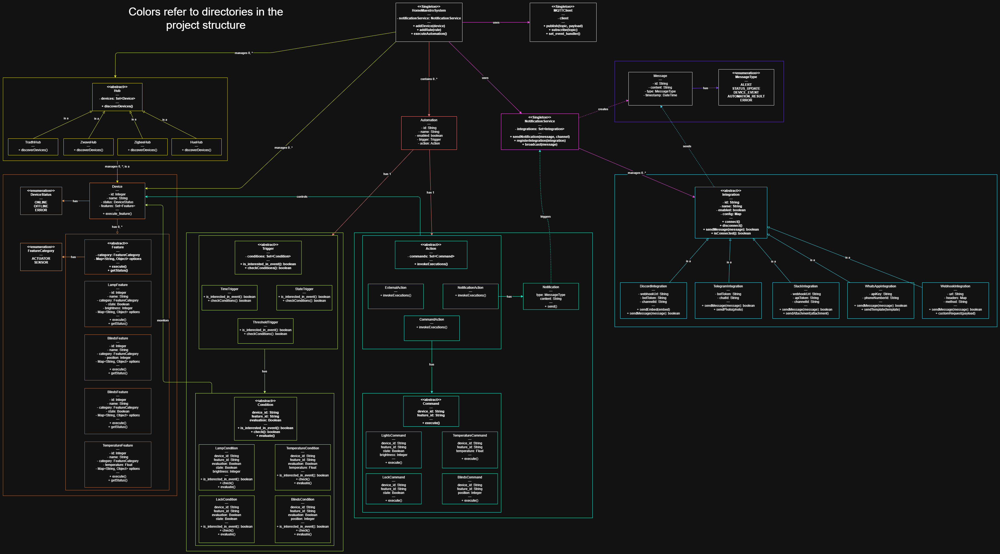
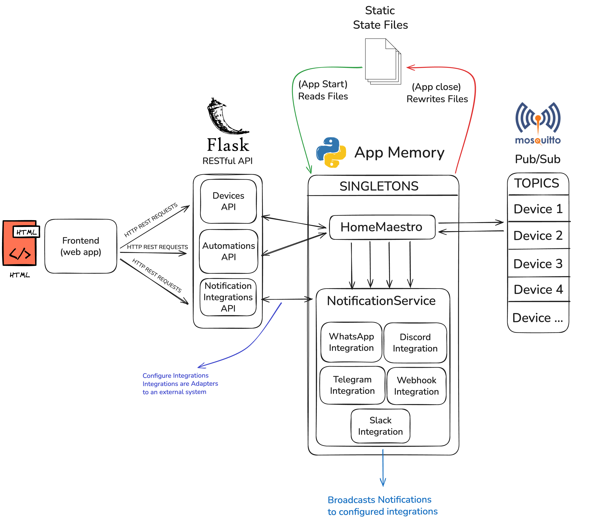
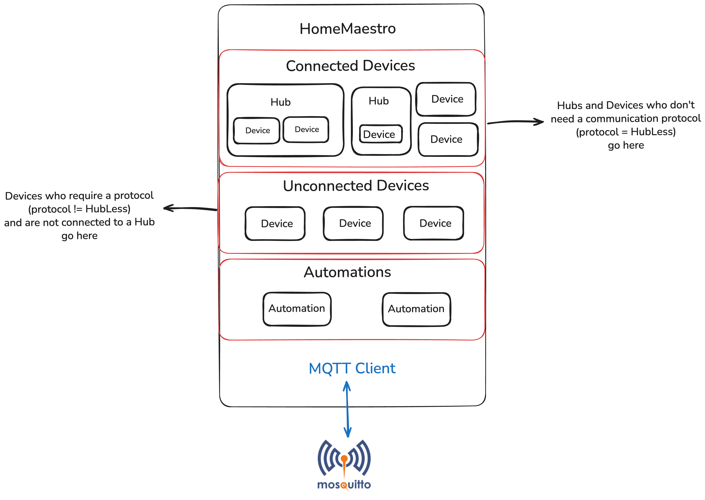
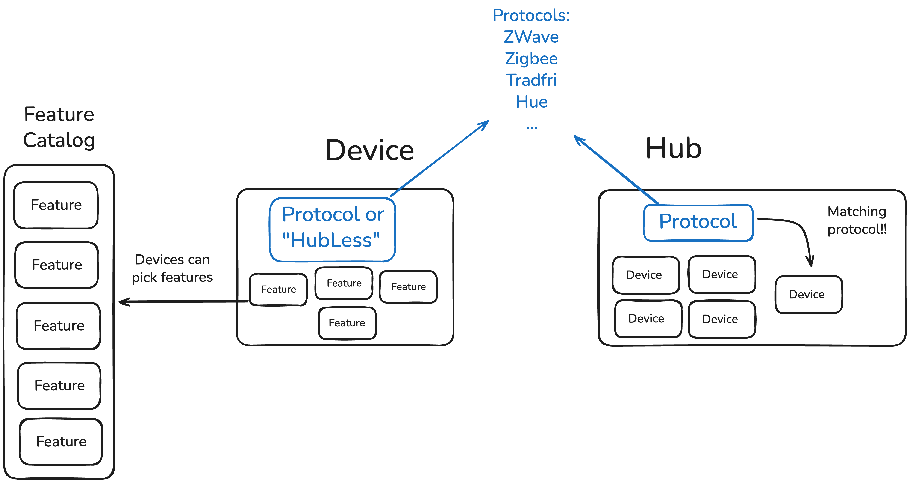
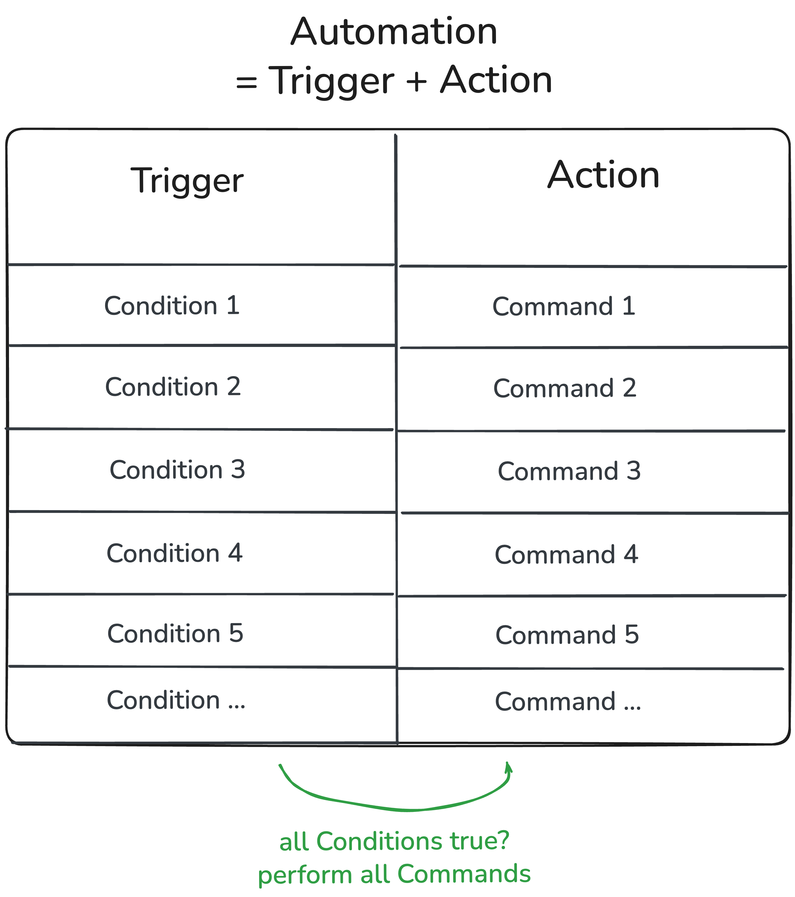
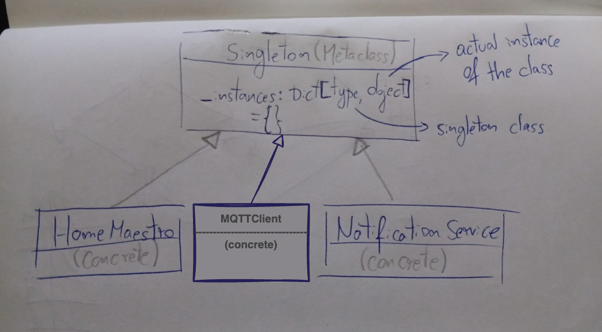
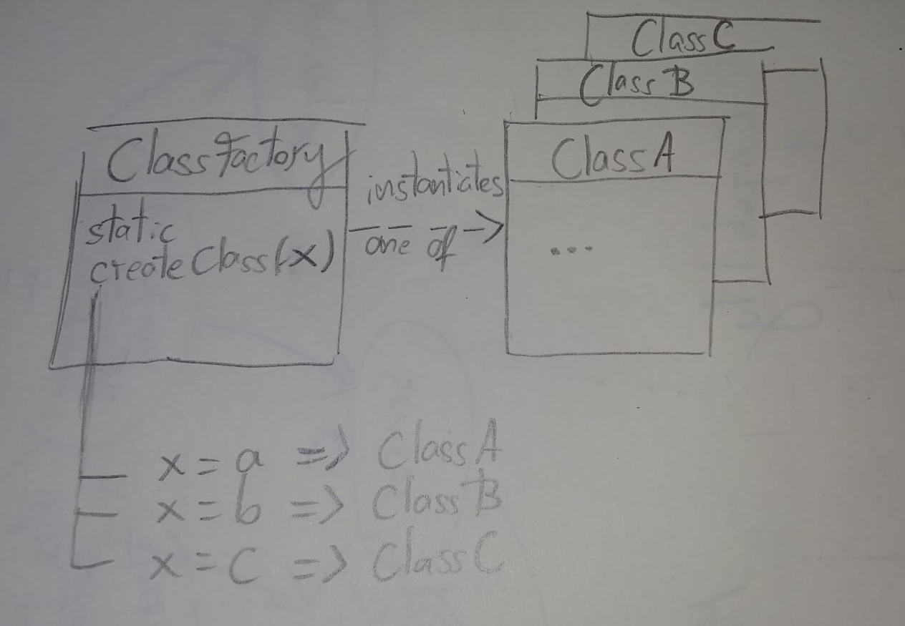
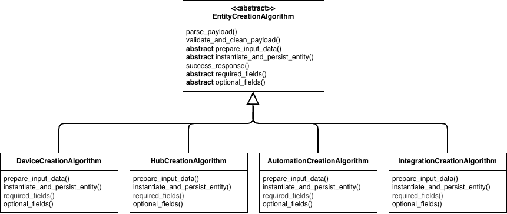
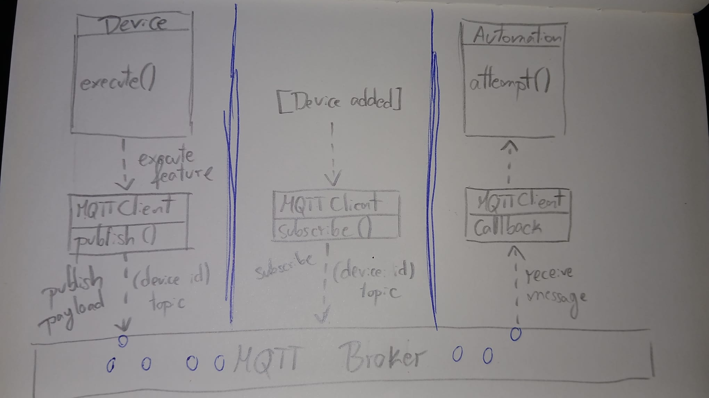
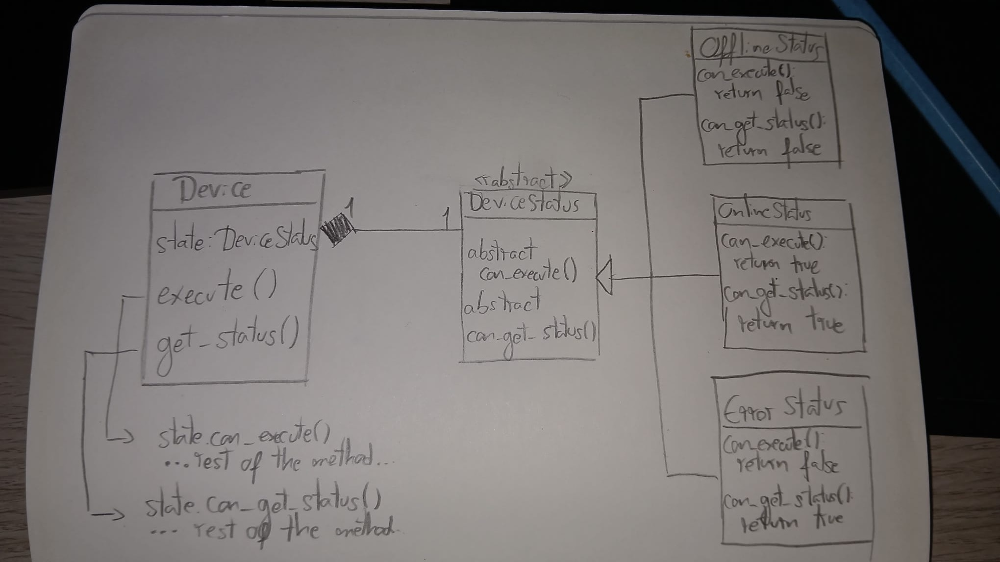

# Project Architecture

[High Level Class Diagram (draw.io)](https://app.diagrams.net/#G1Dm2RSYODV8ipJ_am0yr1ROCWjzooqt7y)



## High Level Software Architecture



## Home Maestro Singleton Diagram



# Device, Hub and Automation Classes Diagrams




# Design Pattern Documentation

## 1️⃣ Singleton

### Problem

As we (initially) decided to start with in-memory state persistence for our application, we needed actual space in memory to save the state, which in our case would be the devices and automations. Therefore, we needed a way to access this state from multiple places in the code.

Using global variables that you pass around in the code, namely lists or key-value pairs, would be a possible solution. However, it wouldn't encapsulate extra logic or behavior that could be of interest to us when persisting state. 
> *Change: In retrospect, this additional encapsulation doesn't really make sense. (for context, refer to the [What we should've done](#what-we-shouldve-done) section). TL;DR: Using raw lists or key-value pairs would've more accurately represented a database and led to a better design.*

To include this additional desired logic, we could create a class that wraps the lists or key-value pairs that we would use to store the state, including any additional logic we desire. However, we would still need to pass around the instance of this class to every part of the code that would need to access it. 

**This requirement, to frequently access a class instance, was one of the main problems we had to solve.**

**The other problem was the fact that the application should always only have a single state. Therefore, even if we could access the class instances mentioned before, there should only ever be one of them, as they are the ones holding application state**

Similarly, we also have the need to access the `MQTTClient` instance around the code, as it is used in multiple places to publish messages to our broker. And in the same manner, there should only ever be a single instance of this class, as it holds the connection to the MQTT broker, which should only be established once.

### Pattern

> Change: although we moved forward with the Singleton pattern, using a proper layered architecture along with Dependency Injection when necessary would lead to a better design. For context, refer to the [Lacking a Proper Service Layer](#lacking-a-proper-service-layer) ending section.

To solve the problems previously mentioned, the Singleton pattern was applied to the classes we wanted to access globally, namely `HomeMaestro`, `NotificationService`, and `MQTTClient`.

We make use of a Python Metaclass (class of a class that defines how a class behaves) to handle the instance creation and control, allowing us to provide Singleton behavior to any class that uses this Metaclass in a clean and reusable way.

Using a Metaclass allows us to model the resulting concrete Singleton classes (HomeMaestro, NotificationService, and MQTTClient) exactly as if they were regular classes. The only difference would be that we know beforehand there will only be one instance of them (and therefore their constructor method will only be called once). 

Using a Metaclass also complies with the Open/Closed Principle, as we can add Singleton behavior to any class without modifying its code, and to the Single Responsibility Principle, as the Singleton Metaclass is solely responsible for ensuring the uniqueness of the instance, [as opposed to what is described in many Singleton pattern descriptions](https://refactoring.guru/design-patterns/singleton#pros-cons) *"(Violates the Single Responsibility Principle. The pattern solves two problems at the time.)"*.

**UML Diagram:**



**Source code:**

\- [Singleton Metaclass](src/backend/shared/singleton.py) (the important part)

\- [HomeMaestro Class](src/backend/shared/home_maestro.py)

\- [NotificationService Class](src/backend/shared/notification_service.py)

\- [MQTTClient Class](src/backend/shared/mqtt_client.py)


### Consequences

This usage of Singletons allows us to access the global instance of our Singletons from anywhere in the code without needing to pass around instances. For example, we can simplify access to the `HomeMaestro` instance by simply calling `HomeMaestro()` anywhere in the code.

Therefore, by using Singletons, we can easily update or access the single current state of the application or use a service like `MQTTClient` from anywhere in the code.

From the developer perspective, the Singleton pattern is commonly used and well-known, allowing a faster implementation and lowering the project learning curve.

However, a developer who is not acquainted with the design pattern might interpret that we are creating multiple instances of the Singleton class, which can be confusing. For instance:

```python
home_maestro = HomeMaestro() # New object?
```

❓ Fun fact: [Python documentation](https://docs.python.org/3/faq/programming.html#how-do-i-share-global-variables-across-modules) itself recommends using dedicated modules for sharing global variables. Therefore, it is technically possible to implement a Singleton by having a module that contains a private variable that holds the instance, and a public function that gets/creates the instance and returns it. However, in Python, visibility modifiers are a convention based on naming rules and are not enforced by the language itself, so it would be possible to create multiple instances of the class if the developer is not careful or if something unexpected happens.

## 🏵️ (Method) Decorator

### Problem

Inside our API route handlers, throughout business operations, we often need to raise exceptions when something goes wrong (e.g., invalid input, entity not found, etc) to abort the current operation and provide feedback to the client.

Something such as:

```python
try:
    # ... any exception-prone snippet of code ...
except Exception as e:
    return ("Internal Server Error", 500)
```

This requires us to repeat the same generic exception handling code in multiple places in the code (even if we wrap the entire API route handler, we would still need to repeat the process in every endpoint). 

**This would lead to a considerable amount of code duplication, which is the main problem we want to solve by applying this pattern.**

### Pattern

A simplified version of the Decorator pattern was in our project, in the form of generic Python decorators. Instead of wrapping objects to extend their behavior, as described in the original Decorator pattern, we apply the same concept to functions instead.

In our case, the decorator that we implemented is named `validates_exceptions`. It is used to deal with top-level API endpoint handler exceptions, as it captures any exceptions raised during the execution of the operations inside the endpoint and converts them into appropriate HTTP 500 error responses.

**Structural Explanation**

Under the hood, what's happening inside the API endpoint is exactly the equivalent of:

```python
@devices_api.route("/", methods=["GET"])
def get_devices() -> Response:
    # ... decorator logic ...
        devices = [device.to_dict() for device in home_maestro.devices]
        return make_response(devices)
    # ... decorator logic ...
    # return ...
```

**Source code:**

\- [Validates Exceptions Decorator](src/backend/api/api_shared/validates_exceptions.py)

\- [Usage Example in Devices API](src/backend/api/devices_api/devices_api.py)

### Consequences

Once the decorator is implemented, we can apply it right on top of any API endpoint handler method that requires this behavior.

By using this approach, the API route handlers can become cleaner and don't have to worry about returning appropriate error responses, as this is now handled by the decorator. They only need to worry about raising exceptions with a message that would be meaningful to the user.

Using a decorator also allows us to easily add behavior for instances where exceptions are caught, such as logging the errors to a file or a monitoring system.

This approach also integrates seamlessly with additional custom decorators or decorators from third-party libraries (such as Flask's), just as described in the conventional Decorator pattern. The only constraint is that the order of the decorators matters, as they are applied from bottom to top. In our case, we always need to apply our decorator before defining the API route through Flask's decorator.

**Usage Example:**

```python
@devices_api.route("/", methods=["POST"])
@validates_exceptions
def add_device() -> Response:
```


In the cases where we could want a server only exception to occur, for example, in cases where we need more detailed logging on the server side to happen without exposing unnecessary or sensitive details to the user, we can still write our custom try-catch blocks inside the API handlers as we normally would, and chose to deal with any caught exception by ignoring them/treating them differently/re-raise them with a more user-friendly message.

The only downside of using this approach would be that someone might be tempted to apply the decorator to a method that doesn't actually require it, such as a small utility function. This function could then start returning HTTP responses instead of its intended return type, which could lead to confusion and bugs in the code.


## 🏭 Simple Factory

> It is debatable whether a Simple Factory is a design pattern or not. However, given its frequent usage in our project, we decided to include it in this report. For more context on what the Simple Factory consists of, refer to [this article](https://refactoring.guru/design-patterns/factory-method/simple-factory).
> 
> Technically, this pattern could easily be scaled up to a Factory Method. However, given the current state of the project, we don't have any place where we need polymorphic object creation through inheritance, which is the main problem that Factory Method solves. Therefore, we are only using the simpler Simple Factory approach.

### Problem

During multiple occasions in our code, we find ourselves needing to create objects that can be of multiple concrete classes, based on some input parameter. Usually, this input parameter is a "type" string sent in the HTTP request that indicates which kind of concrete class to instantiate.

### Pattern

Simple Factory methods were used to simplify the creation of objects that can be of multiple concrete classes, chosen based on a provided input parameter, usually `type`.

**UML Diagram:**



This pattern can be found in the following Factory classes:

**Source code:**

\- [Hub Factory](src/backend/devices/hubs/hub_factory.py)

\- [Action Factory](src/backend/automations/actions/action_factory.py)

\- [Feature Factory](src/backend/devices/features/feature_factory.py)

\- [Condition Factory](src/backend/automations/triggers/conditions/condition_factory.py)

\- [Trigger Factory](src/backend/automations/triggers/trigger_factory.py)

\- [Command Factory](src/backend/automations/actions/commands/command_factory.py)

\- [Device Status Factory](src/backend/devices/device_statuses_factory.py)


### Consequences

Making use of this pattern allows us to centralize object creation logic in a single location, making the creation of those concrete objects easier.

Structuring the code in this way makes it considerably easier to maintain and extend the list of supported concrete classes whenever changes are required.

Although we still rely on a chain of "ifs" (or switch-case statements) to determine which concrete class to instantiate, this logic is now encapsulated within the Factory class, and not scattered all over the code.

A notable constraint of this approach is that, for some kinds of Factory, we might need to instantiate dependencies of the concrete classes inside the Factory class itself, which could lead to a violation of the Single Responsibility Principle. 

For example, to create a new Automation through the Automation Factory, we first need to create a Trigger and an Action. Therefore, the Automation Factory also needs to know how to create those dependencies, which could lead to a bloated Factory class that handles too many responsibilities.


## 🧮 Template Method

### Problem

Given the nature of our application, is it common to have multiple API endpoints that follow a similar series of steps to complete an operation, with only minor variations in the specific details of each step.

In our case, we support adding multiple types of entities (Devices, Hubs, Automations, and Integrations) through POST endpoints. However, the overall process of creating these entities follows a similar pattern: 
1. parsing the payload, 
2. validating the incoming data, 
3. preparing the data to be used, 
4. creating the actual entity, 
5. adding it to our persisted state, 
6. and finally returning an appropriate response.

Besides that, if we were to add any new type of entity to our system in the future, we would most likely need to follow the same series of steps to create it.

This behavior leads to two problems:
1. **We need to enforce a consistent set of steps for creating entities across multiple different scenarios.**
2. **We want to avoid duplicating similar code across multiple endpoints.**

### Pattern

Since most of the code for these steps is the same, we can encapsulate the common logic in an abstract base class, which defines the overall structure of the process while allowing subclasses to implement specific details. This is the **Template Method** design pattern.

We applied this pattern to the process of creating entities of different types, since it was the most common operation that followed a complex enough structure that would justify using the pattern.

Behavior that should be implemented by subclasses would only be:

- Setting the required and optional fields to be sent in the payload for the entity to be created;
- Preparing the data to be used as the input for the target entity constructor method;
- Creating the actual entity instance and persisting it in the application state.

While everything else, such as parsing the payload, validating the data and returning the appropriate response, is handled by the abstract base class.

**UML Diagram:**



**Source code:**

\- [AutomationCreationAlgorithm](src/backend/api/endpoint_templates/automation_creation_algorithm.py)

\- [DeviceCreationAlgorithm](src/backend/api/endpoint_templates/device_creation_algorithm.py)

\- [EntityCreationAlgorithm](src/backend/api/endpoint_templates/entity_creation_algorithm.py)

\- [HubCreationAlgorithm](src/backend/api/endpoint_templates/hub_creation_algorithm.py)

\- [IntegrationCreationAlgorithm](src/backend/api/endpoint_templates/integration_creation_algorithm.py)

### Consequences

Using this pattern results in a much cleaner code, since about 75% of the code required to create an entity is now encapsulated in the abstract base class, making every creation algorithm more concise while abstracting away things that are common to all entity creation processes.

Afterwards, we can simply invoke the algorithm method that orchestrates these steps in the correct order in each API entity creation endpoint.

An existing constraint is that we are enforcing a really specific structure for creating entities, which could lead to some inflexibility in case we wanted to change the process for a specific entity type. However, in these cases, we could always override the abstracted methods or simply opt not to use the Template Method for that specific case.

## 🎧🎤 Publisher-Subscriber

### Problem

In our system, we needed a way to enable communication between different components. For example, when a device's feature is executed, other parts of the system might need to react to that event. Note that here, a real Device will be an external component that communicates over a network.

While using an approach like the Observer pattern could work for virtual devices, since they could be represented by an in-memory object, it wouldn't be a suitable way to represent real devices that communicate over a network, as they can't directly observe the changes in our system.

Therefore, we had to use another kind of communication: an **event-driven architecture**.

### Pattern

The Publisher-Subscriber pattern was used to solve this problem. In this pattern, publishers (devices, regardless of whether they are real or virtual) broadcast messages to a specific topic, and subscribers (automations) listen to those topics to receive messages. This decouples the producers and consumers, as they only need to agree on the topic structure and message format, and allows us to pass data from the devices to the system.

In our project, we implemented this pattern using the MQTT protocol. The `MQTTClient` class acts as the central component for managing subscriptions and publishing messages. Devices, automations, and other components interact with the `MQTTClient` to send and receive messages.

**UML Diagram:**



**Source code:**

- [MQTTClient Class](src/backend/shared/mqtt_client.py)
- [HomeMaestro Class](src/backend/shared/home_maestro.py) (sets up subscriptions and event handlers, which are callbacks invoked when messages are received on subscribed topics)
- [Device Class](src/backend/devices/device.py) (publishes messages when features are executed)
- [Automation Class](src/backend/automations/automation.py) (automations are attempted when messages are received on subscribed topics)

### Consequences

Using the Publisher-Subscriber effectively enables the usage of real devices in our system, as they can communicate with the main system asynchronously through MQTT messaging.

> Note: Despite implementing this pattern, we still don't have real devices integrated into our system yet. For more context, refer to the [State Pattern and Real Devices](#state-pattern-and-real-devices) section.

For each device that we add to the system, we can now subscribe to an isolated broker topic to receive relevant messages. For breaking down events into separate topics, we follow a topic structure where each device has its own topic, corresponding to its unique ID.

Then, we can listen for messages on these topics and trigger automations or other actions based on the received data.

Another advantage of using this pattern and communication style is that we can easily add new decoupled software components to the current system, as long as they can communicate through MQTT to send and receive messages, following an event-driven architecture. 

A possible example would be a real-time monitoring dashboard that subscribes to all device topics and displays information on the latest events.

## ⏻ State

### Problem

In our system, devices can be in different states (online, offline, or error), and their behavior can vary based on their current state.

Besides that, given the nature of our project and IoT devices, there may be a need to add more states in the future, or even change the behavior of existing states to better reflect real-world scenarios.

Given these requirements of diverse, extendable, and changeable behavior based on state, **our state-dependent methods could become cluttered with conditional statements**, making the code harder to read and maintain, which is the **main problem we want to solve**.

### Pattern

To address this, we implemented the **State design pattern**, which allows our Device objects to alter their behavior when their internal state changes. 

Instead of using conditional statements to check the device's state, we encapsulated the desired variation of the behavior for each state in a separate class. We also made use of an abstract base class to define the interface that all state classes must implement.

We arrived at the following State classes:

- `OnlineState`: Represents a device that is online and fully functional. In this state, all device features can be executed normally.
- `OfflineState`: Represents a device that is offline. In this state, any attempt to execute a device feature will result in an exception being raised, indicating that the device is not reachable. Likewise, any attempt to obtain the device's current status will also raise an exception.
- `ErrorState`: Represents a device that is in an error state. Similar to the offline state, any attempt to execute a device feature will raise an exception, indicating that the device is currently experiencing issues. However, obtaining the device's current status is still allowed in this state.

**UML Diagram:**



**Source code:**

\- [DeviceState Abstract and Concrete Class](src/backend/devices/device_statuses.py)

### Consequences 

We can now easily add more states, change existing state-based logic, or extend states' behavior without modifying the core Device class, making the code more maintainable and extensible.

The Device class is also cleaner, as we don't have to deal with multiple conditional statements to handle state-dependent behavior.

Another advantage of this approach is that we can also define state-change logic within the state classes themselves, allowing for more complex state transitions if needed in the future, although it is not the case as of now.

# Project Retrospective

## 🧩 Patterns used

Out of the patterns that were used in the project, we consider that most of them were appropriate for the problems we were trying to solve. Although the Publisher-Subscriber pattern doesn't make a lot of sense in the current state of the project, it still makes sense to eventually implement it, as we are planning to move towards real devices that would communicate asynchronously through MQTT messages.

**The exception to the last paragraph would be, in our opinion, the State design pattern used in devices.**

### State Pattern and Real Devices

Given the requirements of the project, the separation of different Device states' behavior was neither necessary nor very beneficial. We were limited to only three states, and the behavior of two of them (offline and error) happened to only be a simple restriction of actions that could be performed on the device, rather than a completely different behavior. 

It was therefore easier to simply check for those states in the methods that required it (if that meant creating and repeating two conditions for the methods where state was used, we could create a helper function), rather than creating separate classes for each state and delegating the behavior to them, which made the project structure more complex with no real benefit.

A case where the state pattern could actually be beneficial and make sense to use would be when we move towards real devices, as those could introduce more states or more complex behaviors. 

**However, in this regard, we also made a fundamental mistake of assuming every Device is a virtual Device**, which would not necessarily be true, as we also planned to include real devices in our system, which can't be represented by the current Device class.

**While the current Device class implementation is fine for virtual devices, our "real" devices entity class should not have many of the attributes that are present in the "virtual" devices entity**. For virtual devices, behavior like executing features or sending commands should've been handled by a separate class, namely the one mentioned in the Service Layer section [below](#lacking-a-proper-service-layer).

**Therefore, whether we even needed to store a Device state in the first place was debatable**.

## Lacking a proper Service Layer

Currently, entity classes (Device, Hub, Automation) rely on global Singleton instances (HomeMaetro and MQTTClient, in our case) on some of their methods. This indicates a bad design, as the base entity class and the global instance are tightly coupled.

Even if we were to use Dependency Injection to provide the global instance to the entity classes as discussed before in the Singleton section, making them more decoupled and testable, we are still making a fundamental mistake of making a base entity class dependent on the implementation of a global service, which it should not even be aware of. An entity class should not be aware of how to access or use global services, as this violates the Single Responsibility Principle and makes maintenance and testing more difficult.

In our case, we could technically make those service transactions directly inside the API route handlers, although this would break the SRP and DRY principles, since we would be repeating code often and mixing business logic with API handling logic.

### What we should've done

Instead, we should create a new Service Layer for our project (which we are currently lacking). What we currently have is the HomeMaestro class, which is working both as the persistence layer and also includes some parts of the service layer.

For example, we would have DeviceService that would be responsible for handling all interactions between the entity classes and the global services (HomeMaestro, MQTTClient, etc..). Ideally, we would also include here the persistence logic for the entities in this same service (even if we are not technically using a database yet, we could still use simple in-memory lists or key-value pairs as the persistance here), and later on if we decided to move towards a proper database solution, we would not need to refactor anything other than the persistance logic inside the service layer.

**This proposed design would also mitigate the need to use the Singleton design pattern, as we could provide the HomeMaestro, MQTTClient, or other necessary class instances through Dependency Injection.**

## Lacking Operation Atomicity

Another problem detected was that, currently, business operations are not atomic, meaning that if an error occurs during the operation, the system can be left in an inconsistent state.

For example, when creating an automation, if an error occurs after the Trigger and Action have been created but before the entire operation is complete, we could end up with partially created automations or orphaned entities.

To solve this problem, we would need to implement transaction management in our application, ensuring that either the entire operation is completed successfully or none of it is applied, maintaining system consistency.

Although implementing transaction management with our in-memory state persistence could be challenging, doing so by applying a design pattern such as [Unit of Work](https://martinfowler.com/eaaCatalog/unitOfWork.html) would be ideal, especially when developing robust and reliable applications. This factor is something we will consider when architecting future projects.

## Conclusion

Designing, iterating, and reflecting on the architecture that led to this problem was a valuable learning experience, as we were able to refresh concepts such as having a proper layered architecture and the importance of separation of concerns in software design. Although things *work* so far (due to the lack of complexity of the project), it doesn't mean they are well-designed, maintainable, or testable.

Besides that, we were also able to come to the realization that some of the design patterns we used (namely Singleton and perhaps State design patterns) were not really necessary or were the fruit of a lack of knowledge at the time of implementation. Regardless of the cause, these patterns made sense to implement given the match between the problems we had and the problem each pattern solves.

That being said, documenting the patterns as they were being used in this report would also have helped us reflect more on the design choices, detect some of the present flaws sooner, and arrive at a better design overall. This is something we will take into account for future projects.
