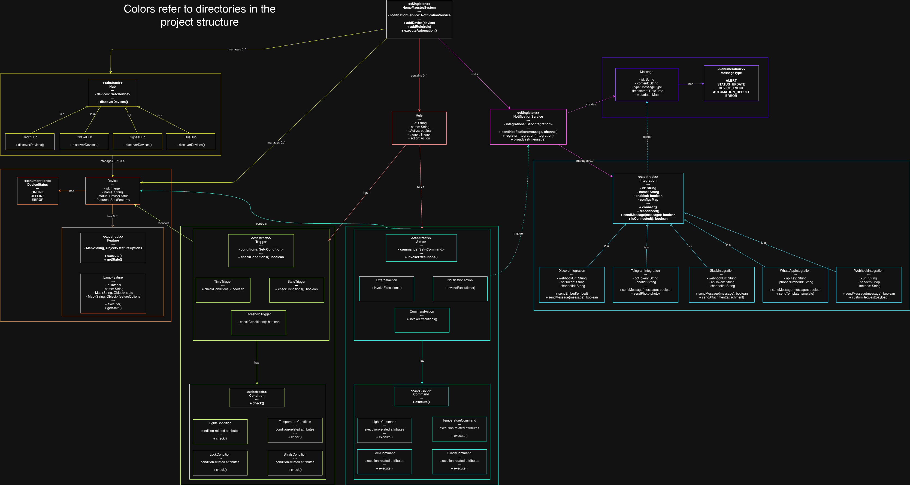
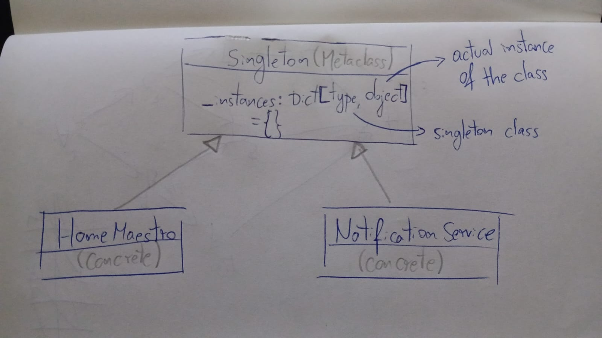

# Project Architecture

[Updated Domain Model (draw.io)](https://app.diagrams.net/#G1Dm2RSYODV8ipJ_am0yr1ROCWjzooqt7y)



# Design Pattern Documentation

## 1️⃣ Singleton

### Problem

Accessing a single instance of a class in multiple places, across a complex project structure such as the present one, can be messy and challenging. Typical programatic solutions include passing the instance of the desired class as a parameter to functions or classes that depend on it, or pointing to highly controlled global variables.

### Pattern

The Singleton pattern was applied to our commonly shared classes, namely `HomeMaestro` and `NotificationService` (as of right now).

We make use of a Python Metaclass to handle the instance creation and control, allowing us to provide Singleton behavior to any class that uses this Metaclass in a clean and reusable way.

**UML Diagram:**



**Source code:**

\- [Singleton Metaclass](src/backend/notifications/notification_service.py)

\- [HomeMaestro Class](src/backend/home_maestro/home_maestro.py)

\- [NotificationService Class](src/backend/notifications/notification_service.py)

The motivations behind the choice were the need to have a simplified interface for working with these classes across diferent parts of the code (classes, API endpoints, etc..) as well as the guarantee that only one instance of these classes would ever exist simultaneously, allowing us to maintain a single state of current `Devices` or `Integrations` (notifications), for example.

### Consequences

**Pros**

- 🟢 Target classes can only be instantiated once, ensuring all parts of the program share the singleton instance (HomeMaestro and NotificationService).

- 🟢 Simplified access to the class instance, by acting like a global variable (accessible anywhere through `home_maestro = HomeMaestro()`, for example).

- 🟢 Singleton pattern is commonly used and well-known, allowing a faster implementation and transition from other programming languages while also lowering the project learning curve, as opposed to more complex practices like dependency injection and state management.

**Cons**

- 🔴 Using the Singleton pattern would usually imply we are violating the Single Responsibility Principle, as a single class is responsible for both providing global access to an instance and ensuring that only this one instance exists.

  🟡 **Note:** By using a Python Metaclass to implement the Singleton pattern, we can overcome this issue by splitting the responsabilities. For example, HomeMaestro is completely unaware that it is a Singleton and behaves exactly like a regular class would do, providing access to itself, while the Singleton Metaclass is responsible for ensuring that only one instance of HomeMaestro exists.

  ```python
    class Singleton(type):
        # ensures unique instance
        _instances = {}

        def __call__(cls, *args, **kwargs):
            if cls not in cls._instances:
                cls._instances[cls] = super().__call__(*args, **kwargs)
            return cls._instances[cls]

    class HomeMaestro(metaclass=Singleton):
        # regular class implementation
        ...

  ```

- 🔴 A developer who is not acquainted with the design pattern might interpret that we are creating multiple instances of the Singleton class, which can be confusing. For instance:

  ```python
  home_maestro = HomeMaestro() # New object?
  ```

  🟡 **Note:** The Singleton design pattern is, however, a fairly common and popular design pattern.

- 🔴 [Python documentation](https://docs.python.org/3/faq/programming.html#how-do-i-share-global-variables-across-modules) itself recommends using modules instead of Singletons for global state management, as it is a more straightforward approach.

## 🏵️ (Method) Decorator

### Problem

Sometimes it is required to extend the behavior of existing objects (or in our case, methods) without modifying their code directly. This also applies when we are free to change the desired implementation, but still want to add the same behavior to multiple objects/methods while extracting duplicate code.

A possible solution is to use inheritance, although this can be limited by the programming language's constraints or can lead to a complex hierarchy.

### Pattern

A simplified version of the Decorator pattern was in our project, in the form of generic Python decorators. Instead of wrapping objects to extend their behavior, as described in the original Decorator pattern, we apply the same concept to functions instead.

One of the generic decorator that we opted to implement is named `validates_exceptions`. It is used to wrap API endpoint handler methods, and it captures any exceptions raised during the execution of the endpoint method and converts them into appropriate HTTP error responses. It also integrates seamlessly with Flask's decorators, as described in the conventional Decorator pattern.

**Structural Explanation**

Under the hood, what's happening inside the API endpoint is exactly the equivalent to:

```python
@devices_api.route("/", methods=["GET"])
def get_devices() -> Response:
    # ... decorator logic ...
        devices = [device.to_dict() for device in home_maestro.devices]
        return make_response(devices)
    # ... decorator logic ...
    # return ...
```

**Source code:**

\- [Validates Exceptions Decorator](src/backend/shared/validates_exceptions.py)

\- [Usage Example in Devices API](src/backend/api/devices_api/devices_api.py)

The motivation behind this choice was the need to extend the behavior of certain methods (e.g., API endpoint handlers) in a reusable, clean and stackable way.

The `validates_exceptions` decorator, in particular, allows us to handle any unexpected errors that may arise during the execution of the endpoint methods, ensuring that the API responds with an appropriate response while logging information for debugging purposes.

### Consequences

**Pros**

- 🟢 Using the method decorator allows us to extend methods behavior without explicitly modifying the original function code, reducing code duplication.

- 🟢 It is possible to stack multiple decorators to combine behaviors, including framework-specific ones (like Flask, in our case).

- 🟢 Enables quickly adding the decorator to new methods as needed (in our case, new endpoints).

- 🟢 Conforms to the Open/Closed and Single Responsibility principles, promoting cleaner code.

- 🟢 Decorators are a well-known, easy to implement and commonly used design pattern in Python, enabling faster development.

**Cons**

- 🔴 Although stacking decorators is possible, they still need to be called in the correct order to function as intended. In our case, we always need to run the decorators before defining the API route with Flask. Example:

```python
@devices_api.route("/", methods=["POST"])
@validates_exceptions
def add_device() -> Response:
```
